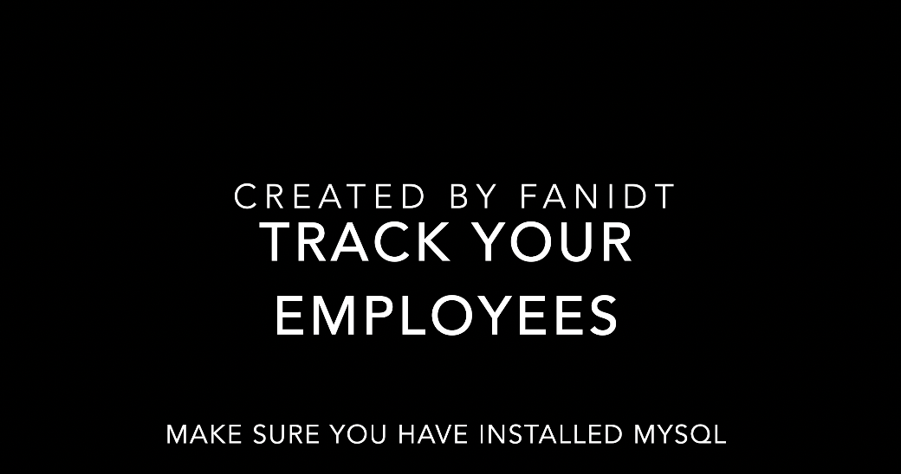

# Track-your-Employees

 ## Link to deployed application/Repository:  
  https://github.com/fanidt/Track-your-Employees

 # Table of contents  
 -[Description](#Description)  
 -[User Story](#UserStory)  
 -[Badges](#Badges)  
 -[Screenshot](##Screenshot)  
 -[Installation](#Installation)  
 -[Usage](#Usage)  
 -[Support](#Support)  
 -[Contributions](#Contributions)  
 -[Authors](#Authors)  
 -[License](#Licence)  

  ## Description:  
  A command line application that makes it easy to add employees and see all the information that this employee has

  ## User Story:  
 AS A business owner
 I WANT to be able to view and manage the departments, roles, and employees in my company
 SO THAT I can organize and plan my business
  
  ## Badges:  
  
  
  ##Screenshot:  
    (https://youtu.be/69qlPXEpXFw)
  
  ## Installation:  
  -> download the file
  -> open the file in the command line
  -> type npm install 
  -> type npm start

  ## Usage:  
  -> select one of the options 
  -> Enjoy :)

  ## Support:  
  Contact us by email at: deltorofanie@gmail.com  
  Contact us at Github at: https://github.com/fanidt

  

  ## Contributions:  
  No contributions allowed

  ## Authors:  
  fanidt
  
  ## Licence:  
  MIT  
  License Link: https://opensource.org/licenses/MIT

